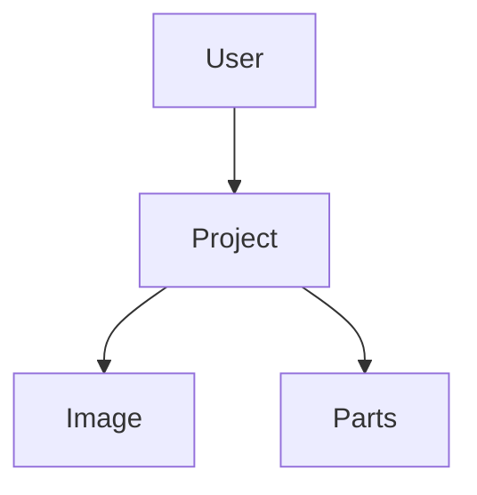

# ww4TestImage
The main objective of this project is to understand if the fiware is able to store media files of a project.
The data structure was defined in a very simple way so that the project fulfills the previously specified function.

