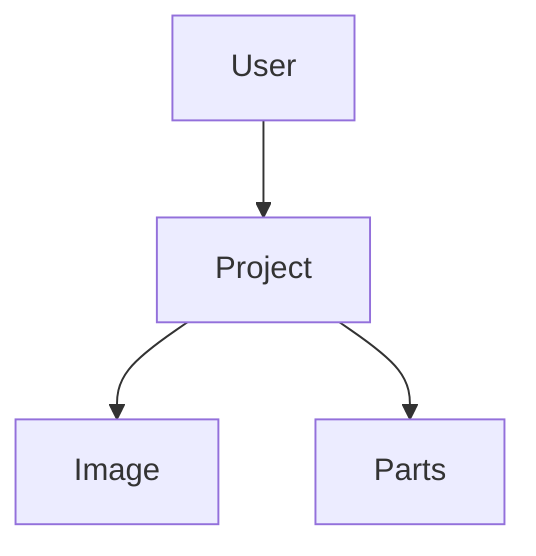

# ww4TestImage
The main objective of this project is to understand if the fiware is able to store media files of a project.
The data structure was defined in a very simple way so that the project fulfills the previously specified function.


The main idea to save the images would be to use a server (node, django, ...) responsible for saving the images of a project. 
Taking into account that the NSGI-LD API does not have the functionality to store images, in this way the static files would be stored on this server and would be responsible for creating an entity in Orion and presenting a link that points to this web server made in (node , django, ...)
```mermaid
graph TD;
    Static FIles--Bucket;
    Bucket--> Entity;
    Entity->ORION-LD;
```
